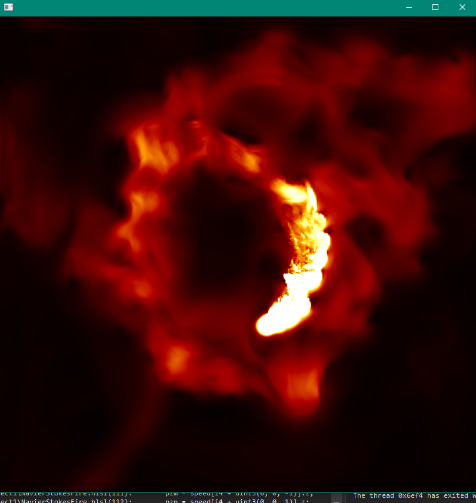
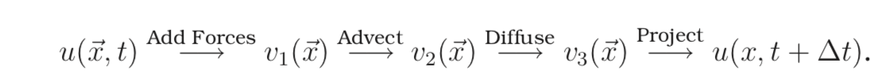
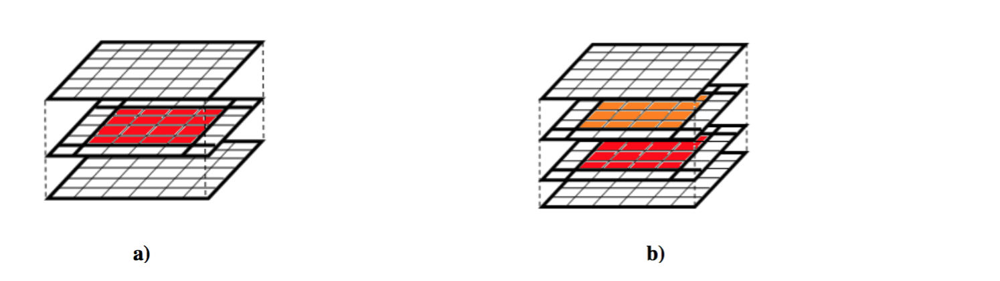
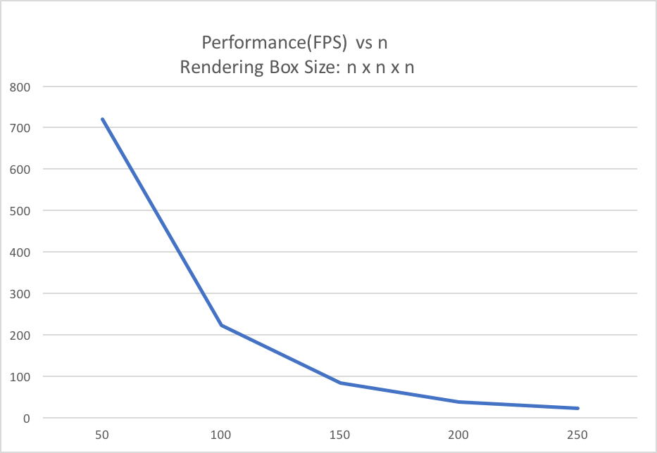
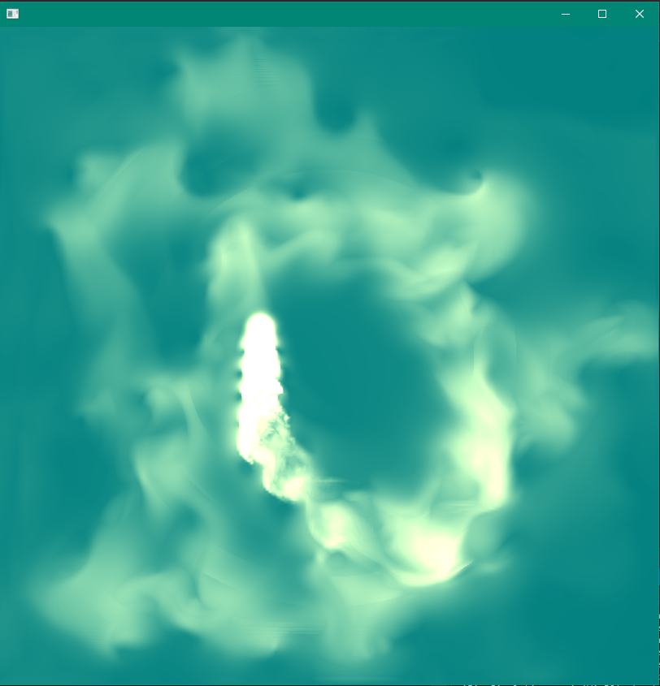
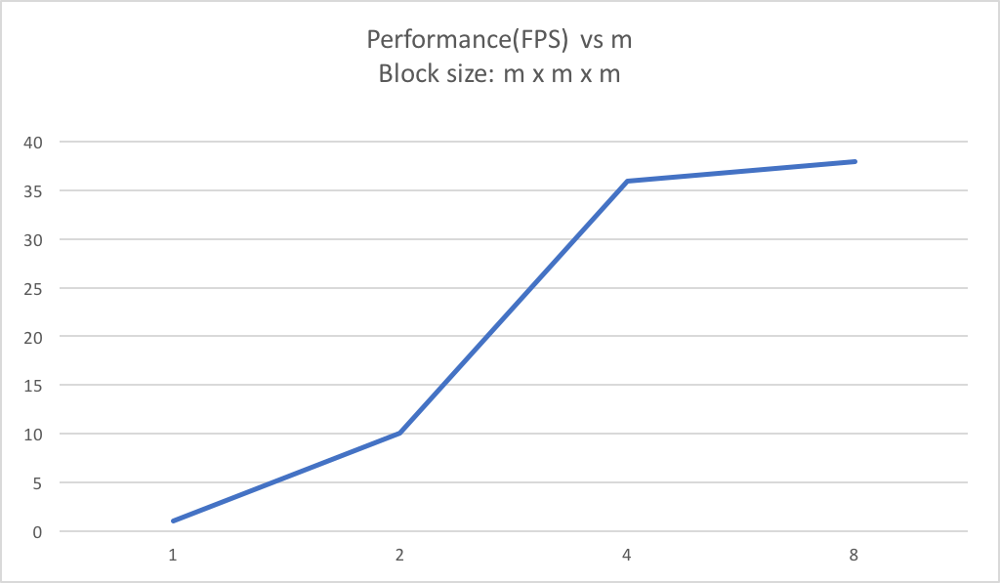
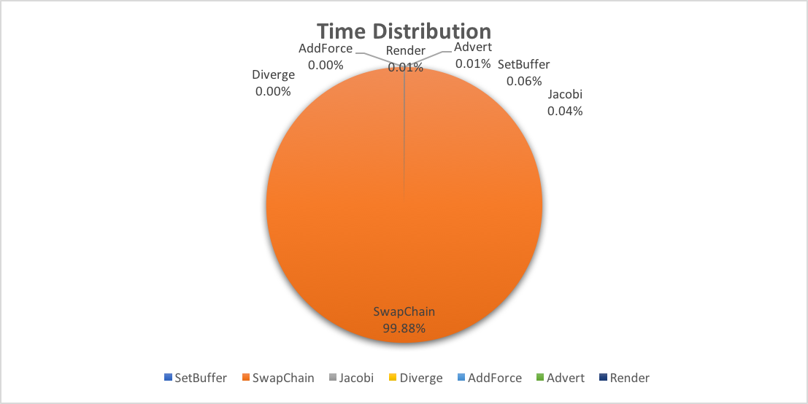
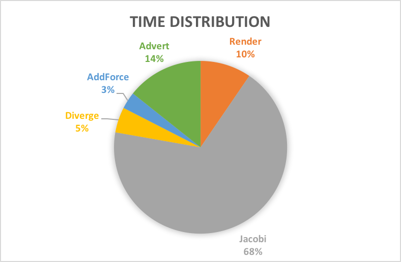

# Link to Poster 
https://docs.google.com/presentation/d/1Esl31lVrWi-zJ_zSCG8Znf92NNgdNU2k_t7QZnSOuoA/edit#slide=id.g4a050b83a1_0_0

# Fire!

# Summary 

This project aims to render fire in real-time by solving Navier Stoke equations. We first implemented particle state simulation and rendering on CPU using Processing and Java, then we switched to using Direct3D to run both simulation and rendering on GPU via compute shaders.

# Background

## Simulation of Navier-Stokes
The Navier-Stokes equations are widely used for simulating fluids. The equations specify the relationship between mass and momentum of fluids, which can be used to simulate phenomenons including water, cloud, smoke, and fire. Our projects simulates fire.

If we define 'u}' as the velocity field, 'p' as the pressure field, 'rho' as the density field, the Navier-Stokes equations can be expressed as 
The common algorithm for simulating Navier-Stokes is using the "stable fluids" method proposed by Stam [Stam 1999]. The simulation divides the space being rendered into a 3D array of cubicle cells, each representing the state of the fluid particle at a particular location. Each grid cell is responsible for storing the physics state such as temperature, pressure, and velocity. In each time step, the simulation is broken down into four operations: Advect, Add Forces, Diffuse and Project. At each simulation time step, the four operations are applied to each particle in the grid. Cells at the boundary must be handled specially. 
	
To obtain a realistic simulation of fluids, a large number of particles and small time step is desired. However, even if we simulate each dimension with only 100 particles, there are $100^3$ particles in total that we need to keep track of. 
	
However, since each grid cell is updated using the same scheme (besides cells at the boundary), and  only reference cells nearby (if any). This highly parallel, coherent nature of the simulation algorithm makes GPU a good candidate for this application.  
	
There are some algorithmic constraints to how much the computation can be optimized. For example , each of the four operations, namely advection, force addition, diffusion and projection, depends on the output of the previous stage and cannot be parallelized. Each time step also depends on the previous time step.

	
## Environment
We used two laptops running on Windos 10 for our development. The first laptop features a 6-core i7 CPU with an NVIDIA GeForce GTX1070 GPU.   The second laptop features a 4-core i7 CPU with an NVIDIA GTX 970M GPU. 
	

# Approach
We uses Direct3D API and C++ for our CPU implementation and HLSL (high Level Shading Language) for our GPU shader programs implementation. We are targeting an x64 machine with an NVIDIA GeForce GPU.
	
## References
Our implementation references from a few sources listed in the References section.

## CPU
We simulate fire by dividing the space into $n \times n \times n$ cubical cells, where n is chosen to be 200 in our implementation. Each cell is simulated using one particle. Each state that the particles are associated with are implemented using an array of $n$ 2D textures with size $n \times n$. Specifically, the states we are simulating are direction of velocity, speed, divergence and pressure. In each time step, the values in the textures are updated in four stages according Navier-Stokes.
        
The program first initializes all resources (constant buffers, textures) vis Direct3D API call, then enters the main loop. In the main loop, particle states are first updated on GPU, then the results are rendered and presented.
## GPU Shaders
All shaders are implemented as compute shaders, since our application doesn't required the standard graphics pipeline. There are five shaders (advect, addForce, divergence, Jacobi, project)  Navier-Stokes simulation, corresponding to the four stages of simulation. There is one shader used for rendering.

## Advection
Advection simulates the process of the fluid transporting itself in a field. This is simulated by first calculating how much the particle has traveled using its velocity, then updating velocity using the sampled quantity at the new position. This compute shader is executed in groups of $16 \times 4 \times 4$ threads. The code snippet for advect shader is shown below.
    	
	float3 newPos = i - velocity[i];
    	newPos = (newPos + 0.5) / dim;
    	velocityRW[i] = velocity.SampleLevel(samLinear, newPos, 0);
    	
        
## AddForce
Add force accounts for how the environment acts external force on the system. In our system, the mouse takes impulse input from the user, and particles around the mouse takes this force into account.
            
## Diffusion
Because fluids that are viscous have a resistance to flow, diffusion of velocity occurs when fluids flow.  The viscous equation, when formulated in discretized form, is in the form of Poisson equations for velocity. An iterative technique for solving Poisson equations is called Jacobi iteration. This technique needs to be executed many times for it to converge. This can be cheaply done on GPU. In our implementation, we run Jacobi iteration 10 times in each time stamp. Jacobi technique requires calculating the divergence of velocity, then using divergence and velocity to calculate the new pressure value.
            
The code snippet for divergence shader is presented below. An micro optimization is done by unrolling the for loop, which allows the system to determine memory access pattern in advance.
       
       
 	float pL, pR, pF, pB, pU, pD;
	float divergence[4];
	[unroll]
	for (int j = 0; j<4; j++){
		uint3 i4 = uint3(4 * i.x + j, i.y, i.z);
		pL = velocity[i4 + uint3(-1, 0, 0)].x;
		pR = velocity[i4 + uint3(1, 0, 0)].x;
		pF = velocity[i4 + uint3(0, -1, 0)].y;
		pB = velocity[i4 + uint3(0, 1, 0)].y;
		pU = velocity[i4 + uint3(0, 0, -1)].z;
		pD = velocity[i4 + uint3(0, 0, 1)].z;
		divergence[j] = (pR - pL + pB - pF + pD - pU) / 2;
	}
	divergenceRW[i] = (float4)divergence;
 
            
            The code snippet for Jacobi iteration is presented below:
     uint3 cL = uint3(max(i.x - 1, 0), i.y, i.z);
	uint3 cR = uint3(min(i.x + 1, dim.x - 1), i.y, i.z);
	uint3 cD = uint3(i.x, max(i.y - 1, 0), i.z);
	uint3 cU = uint3(i.x, min(i.y + 1, dim.y - 1), i.z);
	uint3 cF = uint3(i.x, i.y, max(i.z - 1, 0));
	uint3 cB = uint3(i.x, i.y, min(i.z + 1, dim.z - 1));

	float4 pL = float4(pressure[cL].w, pressure[i + uint3(0, 0, 0)].xyz);
	float4 pR = float4(pressure[i + uint3(0, 0, 0)].yzw, pressure[cR].x);
	float4 pD = pressure[cD];
	float4 pU = pressure[cU];
	float4 pF = pressure[cF];
	float4 pB = pressure[cB];
	
	pressureRW[i] = (pR + pL + pF + pB + pD + pU - divergence[i]) / 6;
	
## Rendering
We render each particle using speed, calculated using the L2 norm of velocity of each particle. Speed is linear interpolated with two colors, representing fire of low 

             
## Projection
The projection step aims at projecting the divergent velocity field to its divergence-free component. This will give us the final updated velocity for each particle. Projection is computationally similar to that of calculating divergence.
       
 	uint3 cL = uint3(max(i.x - 1, 0), i.y, i.z);
	float4 pL = float4(pressure[cL].w, pressure[i + uint3(0, 0, 0)].xyz);
	uint3 cR = uint3(min(i.x + 1, dim.x - 1), i.y, i.z);
	float4 pR = float4(pressure[i + uint3(0, 0, 0)].yzw, pressure[cR].x);

	uint3 cB = uint3(i.x, max(i.y - 1, 0), i.z);
	float4 pB = pressure[cB];
	
	uint3 cF = uint3(i.x, min(i.y + 1, dim.y - 1), i.z);
	float4 pF = pressure[cF];

	uint3 cD = uint3(i.x, i.y, max(i.z - 1, 0));
	float4 pD = pressure[cD];
	uint3 cU = uint3(i.x, i.y, min(i.z + 1, dim.z - 1));
	float4 pU = pressure[cU];

	pR -= pL;
	pF -= pB;
	pU -= pD;

    // this is done for x, y, z, w channel ..
	float4 s;
	i.x *= 4;
	bool borderyz = any(i.yz == 0 | i.yz == dim.yz - 1);
	s = velocity[i] - float4(pR.x, pF.x, pU.x, 0) / 2;
	velocityRW[i] = (i.x == 0 || borderyz) ? -s : s;
	speedRW[i] = length(s.xyz);
	i.x++;
	...
     
        
# Optimization
## Overview
Our project has two main part to be paralleled. First is the calculation of each particle states in each time step. Second is the rendering of the 2D image to be displayed. 
During our implementation of the parallel code, we make use of Nvidia GeForce GTX 970, a GPU with 13 multiprocessors and 1024 threads per block at maximum.
Thus, to parallel the particle states update, we divide the box space in which the fire light up into smaller blocks of $16 \times 8 \times 8$ and map computation inside each of these smaller blocks to a GPU block. Computation inside each GPU block will be further paralleled by the $16 \times 8 \times 8$ threads we assign to each block. We pick this configuration for thread number at first since it is consistent with the maximum number of threads per block of GTX 970. With a lot of threads per block, it would be easier for warp to hide latency by context switching if one of the threads stalls because of memory access. To make sure we have the best configuration for our current GPU, we experimented with multiple other configuration and our current solution turns out to have the highest frame per second.

After multiple experiments over the number of threads. We eventually choose this configuration, since it gives the highest frame per second for our simulation. Also, this value is consistent with the configuration of the GPU we use. 

To parallel the rendering of the two dimensional display image, We divide the display image into smaller tiles of $16 \times 16$ and assign the rendering of each tile to a GPU block, in which each rendering of each pixel in the tile will be assigned to a thread. Thus, we have $16 \times 16$ threads to render all pixels in a block. We get this configuration of tile following the similar process as we described above. We start off from assigning tiles of $32 \times 32$ to each GPU block, yet later after experiments, we figure out that $16 \times 16$ threads per block works the best for our current model.

## Serial Algorithm vs Parallel Algorithm
As for our serial code implementation, we do not need to consider the dependency among steps of solving the Navier stoke equation. However, to implement our project in parallel we need to pick out the parts of differential equation calculation that are dependent on each other and reorder the computation sequence to reduce synchronization between threads. 
Besides, in the parallel version, we need to reconsider how the cache performance might be influenced by the architecture of GPU. Specifically, since each particle in the simulation needs to calculate its Laplacian by getting value from all of its neighbor particles, at the boundary of each block we assigned to GPU, the GPU will inevitably access data that are not included in the shared memory of the GPU block and result in low arithmetic intensity. To increase the arithmetic intensity, we configure each block to have almost equal width, height and depth so that for equal amount of computation, least amount of access to memory outside of shared memory of the block would be triggered. 

As shown in the image above, the uncolored part is the amount of access each block as to the global memory. The block configuration in a is worse than b, since a needs has lower arithmetic intensity. If we keep increasing the size of our block like what is done in b, then the arithmetic will keep increasing at the cost of increasing the granularity of each task and the block data also might be too large to be fit into the shared memory of a GPU block. Thus, to achieve the high spatial locality, we tested different configurations of blocks. 

## Iterations of Optimization
Our first toy implementation of the algorithm was using Processing written in Java, and the simulation is completely run on CPU. This implementation helped us a lot in understanding the Naver-Stokes equation and corresponding algorithms. However, frame per second quickly dropped down to $<$ 8FPS after trying to simulation with $20 \times 20 \times 20$ grids. This is the point when we turned to GPU implementation. 

In the first version of our GPU implementation, we first discovered that we could combine steps to decrease the synchronization between processes. For example, if only one calculation depends on calculation of gradient and these two calculation are paralleled separately, we would combine these two steps and let them be assigned to GPU as one step. In this way, the unnecessary synchronization between these two steps would be eliminated. 
Also, considering the overhead for communication between processes, we needed to decide if we can reduce synchronization between threads and calculate over stale data at the cost of the accuracy of the algorithm. It turned out that the numerical integration we used is sensitive to even minor error in the calculation. Actually, this error would be further enlarged at the simulation of later time steps and generate really inaccurate animation. Thus, eventually we went back to the older version that has more synchronization. At this point, we started thinking by changing the structure of the grid. Thus, like what we have mentioned in the previous paragraphs, we started to try out the best configuration of blocks assigned to GPU and got the data below for different configurations of a block.

Then to further improve our optimization, we think about compressing the texture with sparse matrix. Since the fire is not evenly spread out in the whole space. Normally, it is a speck of light in the space. Thus, we think it would be a good idea to represent state of particles inside each cell of the box using sparse matrix. Yet, this also indicates overhead for accessing a index table that stores index for nonzero data. After we finished the implementation of this sparse matrix representation of textures. There was not much improvement in the frame per second. Also, if the scene becomes smoky after we ignite multiple fire in the scene, the project becomes even a little bit slower than usual because of having the overhead of indirect access of data.

Another idea we had at early stage was to track a set of particles using Lagrangian method instead of discretizing the space using the Eulerian method. We think the advantages of using Lagrangian method is that at some moments of the simulation of burning fire, particles would not be uniformly distributed in space, we can save some memory storage and fit better into cache if we only consider rendering positions taken up by particles. Yet, the disadvantage of this data structure is that it has high overhead for finding neighboring particles, which made it inferior to the Eulerian method which has direct access to all neighbors by accessing nearby cells of the texture.
## Results

## Deliverable

Above is a screenshot of our final demo. The user can change the source of fire by dragging mouse around. User can also view the 3D box by rotating the box using right mouse drag.

## Goal
Our initial goal of this project was to achieve real time simulation of fire. Animation looks acceptable to human eyes with at least 8 frames per second and animation with 32 or higher frames per second are equally good for human eyes. Therefore, our initial goal was to achieve at least 8 frames per second simulation. 
Eventually, for simulation of fire inside a 200 x 200 x 200 box, we can achieve 37 FPS on the machine with NVIDIA GTX 970M GPU and 70 FPS on the machine with NVIDIA GeForce 1070 GPU.

## Fps at different assignment of Threads per block

The image above is discussed in Section 3.3 and it shows that FPS increases as number of threads in each block dimension increases. Thus, we choose to assign $16 \times 8 \times 8$ threads to each block.

## Fps at different problem size

FPS decreases as the problem size increase. This is because that one line in our implementation makes use of a DirectX function called swapChain. This function transfers the prepared framebuffer from GPU to present it on the screen. This step is necessary and its cost cannot be avoided. As our problem size increases,for example, the n* n*n rendering box becomes 2n * 2n * 2n as shown in the graph, the time taken at this step of displaying the image quadratically increases because the image size becomes 4 times as large as before. Also, since operation takes 99\% for our computation time, so it bottlenecks our performance as the box size changes. 
## proportion of running time at different step

This table demonstrates what previously described. SwapChain takes 99\% of our computation time.

This is the run time distribution for all shading process. Jacobi seems to have significantly higher run-time than other shading process. This is because that we need to go over 10 iterations of Jacobi calculation to coverge to an accurate calculation of diffusion. Therefore, this shading process is about 10 times slower than the other calcuation. 

# Distribution of Work
Jackie - toy sequential version implementation and algorithm of solving Navier Stoke equations. Adjust the rendering effect of the GPU version. 50%

Caroline - Rewrite the code for GPU and optimization of code for GPU. 50\% 

# References
*    Stam, Jos. "Stable fluids." Proceedings of the 26th annual conference on Computer graphics and interactive techniques. ACM Press/Addison-Wesley Publishing Co., 1999.
*    Fernando, Randima. GPU Gems. Addison Wesley, 2004.
*    Moastuen, Lars. Real-time simulation of the incompressible Navier-Stokes equations on the GPU. Masteroppgave, University of Oslo, 2007
*    Nguyen, Hubert. Gpu gems 3. Addison-Wesley Professional, 2007.
*    Crane, Keenan, Ignacio Llamas, and Sarah Tariq. "Real\-time simulation and rendering of 3d fluids." GPU gems 3.1 (2007).
